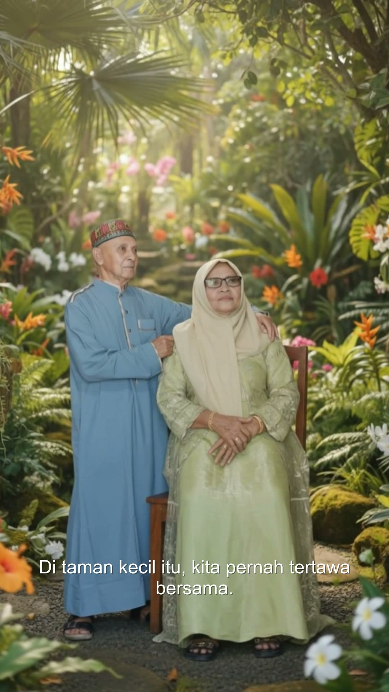
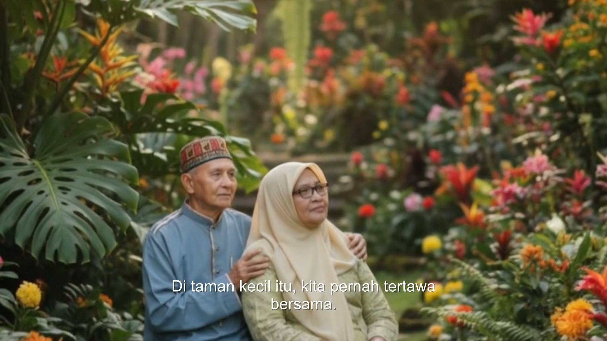

# Demo 04 — Video Pipeline E2E (2026-08-25)

Scripted E2E (`gradlew :app:demoDriver04`) against REAL fal APIs, Standar tier
(Kling 3.0 Std `generate_audio:false`), own-family photos (`kakek1.jpg`,
`kakek2.jpg`, `keluarga.jpg`), Indonesian narration (MiniMax `Calm_Woman`),
bundled music ("Heartwarming", Kevin MacLeod, CC BY 4.0), subtitles on.

## Results (DoD)

| Check | Result |
|---|---|
| 9:16 project → final MP4 | ✅ `Kenangan_Kakek_9x16.mp4` — 13.90s, 1080×1920@30, H.264 High + AAC 48kHz, faststart, `comment=AI-generated (Kenang)` |
| 16:9 project → final MP4 | ✅ `Kenangan_Kakek_16x9.mp4` — 13.90s, 1920×1080@30, same encoding |
| Force-kill mid-generation → resume | ✅ stage A submitted 3 scenes then `Runtime.halt(42)`; stage B resumed from DB rows and polled the SAME fal request ids — **0 resubmissions** (asserted by the driver; polling key-pinned to `key_label`, AD-14) |
| Network-kill resilience | Polling treats Offline/Timeout as transient and keeps retrying until the 15-min deadline (`GenerationOrchestrator.pollUntilComplete`), so a dropped connection resumes in place; the force-kill path above covers the harder full-restart case |
| CostTracker per call incl. `key_label` | ✅ 3 I2V jobs + TTS + keyframes + analysis, all on key `Utama` |
| Assembly performance | 13.9s/1080p assembled in ~30s incl. TTS probe; bare FFmpeg pass on the same class of clips: 17.8s → ~38s extrapolated for 30s video (< 60s budget) |
| Watermark | OFF via `LicenseGate` DevFull (D-002); overlay path exists and is locked by a flag-forced unit test (`FfmpegGraphBuilderTest.watermark on maps overlay bottom-right`) |
| Playable in WMP & WhatsApp | Encoding chosen for it (H.264+AAC 48k, yuv420p, faststart) — owner to double-check on their devices |

## Spend (Phase-04 budget: hard cap $15)

| Item | USD |
|---|---|
| Wan 2.6 flash spot-check (Hemat gate, REVIEW_SHEET row 50) | 0.2500 |
| Project 9:16 (analysis 3× + keyframes 3× + I2V 3×5s + TTS 163 chars) | 1.4005 |
| Project 16:9 (same shape) | 1.4003 |
| **Total** | **3.0508** |

Per-call ledger lives in each project's `gen_cost` rows (SQLite), tagged with
`key_label` — printed by the driver's "[6] Ledger" step.

## Evidence

-  — subtitle bottom-center, 9:16 safe-area margin
- 
- Free iteration on Phase-00 Kling clips: `POC/out/assembly_smoke/` (ducking +
  loudnorm + subtitles + xfade validated before any paid call)

## Decisions & findings baked into code

1. **SQLITE_BUSY under parallel generation** (first stage-A run crashed):
   SQLDelight's stock driver issues deferred `BEGIN`; concurrent
   read→write-upgrade transactions fail instantly (busy_timeout doesn't apply
   to upgrades). Fixed in `DatabaseFactory` — `SQLiteDataSource.asJdbcDriver()`
   with WAL + `busy_timeout=10s` + `transaction_mode=IMMEDIATE`; regression
   test `DbConcurrencyTest`. The crashed run died before any fal submit —
   no orphaned provider spend.
2. **Result screen playback = fallback path** (§4.4): thumbnail + "Putar"
   opens the system player. VLCJ bundling (~80 MB LGPL natives + licensing
   review) not worth it for MVP → recorded in MEMORY §9.
3. **`-ar 48000` on assembly audio**: loudnorm internally resamples to 192kHz
   and AAC came out 96kHz — some players/WhatsApp choke; pinned to 48kHz.
4. **Wan-flash variant routing**: config keeps the base slug (PriceBook key)
   with `i2v_params.variant="flash"`; the orchestrator appends the variant as
   a slug sub-path at submit time only.

## Known gaps (non-blocking, → Stabilization)

- Duration-mismatch dialog's "extend scene durations" is correctly disabled
  post-generation; pre-generation extension lives in the storyboard editor.
- GenerationScreen resume is DB-driven; a restart mid-**assembly** re-runs
  assembly from the start (clips/narration are cached — no API cost).
- Result screen "Buat versi rasio lain" is the specced P2 stub (disabled).
- Owner-side checks: play both MP4s in Windows Media Player + upload one to
  WhatsApp; eyeball GenerationScreen/ResultScreen in the running app (driver
  exercised the services end-to-end, screens compiled + wired via routes).
