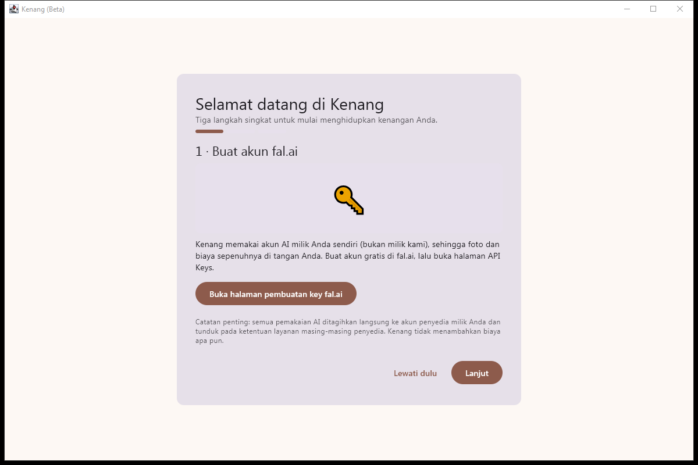
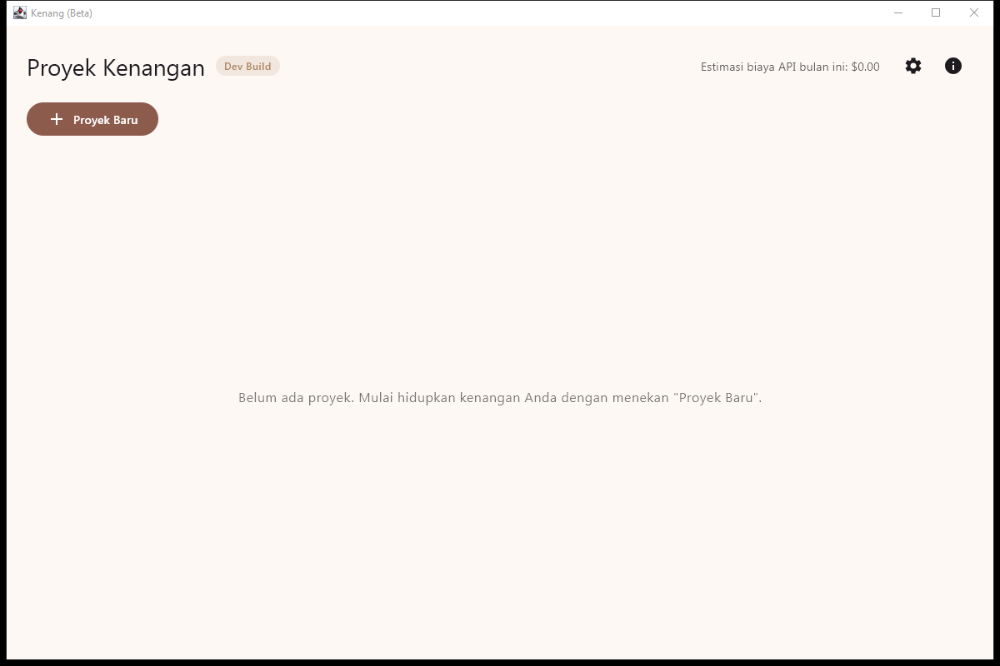
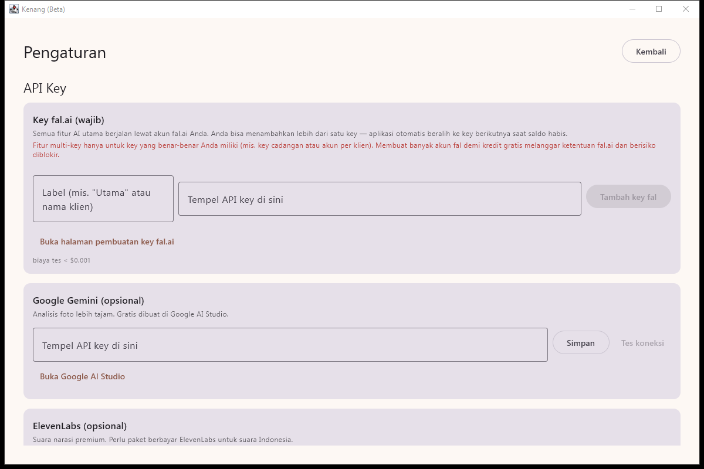

# Phase 02 Shell Walkthrough

State of the desktop shell at the end of Phase 02. Screenshots are captured
from a dev build (`gradlew :app:run`).

## 1. First launch → onboarding wizard

Fresh start (no `%APPDATA%/Kenang`) opens the 3-step wizard — **no license UI
anywhere (D-002)**:

1. **Buat akun fal.ai** — explains BYOK, button opens fal.ai key page, shows the
   BYOK responsibility notice.
2. **Tempel API key** — paste field (masked), saves as ordered-list entry
   "Utama", live "Tes koneksi" (1-token LLM ping, "biaya tes < $0.001"), shows
   the anti-credit-farming notice (MEMORY §7).
3. **Siap digunakan** — points at optional Gemini/ElevenLabs keys in Settings.

Wizard is skippable ("Lewati dulu") and reopenable from Settings.

## 2. Home

- Project grid (thumbnail = first keyframe, else first photo, else placeholder),
  status chip per project.
- Top bar: **"Dev Build" tag sourced from LicenseGate**, this-month estimated
  API spend from CostTracker, Settings/About buttons.
- "Proyek Baru" → placeholder route (Phase 03 owns the real wizard); the
  placeholder can create a sample project to exercise create/persist/delete.
- Delete project: confirmation dialog → DB cascade delete + project folder wipe.

## 3. Settings — API Key manager

- **fal (wajib)**: ordered key list — add (label + masked key), remove,
  reorder (↑/↓ = failover priority), per-key status chip
  (aktif / cadangan / saldo habis), per-key "Tes koneksi".
- **Google Gemini (opsional)** — "analisis lebih tajam", free `models.list` test.
- **ElevenLabs (opsional)** — "suara premium", free `GET /voices` test (note:
  Indonesian voices need a paid EL plan).
- Per-key this-month estimated spend (AD-14 per-client reporting).
- Output folder, language (ID), telemetry placeholder (dormant), app version
  (update check dormant until remote config exists — Phase 01).

## 4. About/Legal

Privacy headline ("foto Anda tidak pernah menyentuh server Kenang"), links to
privacy/terms/licenses, FFmpeg GPL attribution.

## 5. Offline behavior

Network probe fails → amber banner "Anda sedang offline…", key tests disabled,
projects remain browsable (read-only AI features).

## 6. Resume safety

Kill the app (Task Manager) → relaunch: projects, settings, and keys are
intact (SQLite + Credential Manager both survive force-kill).
